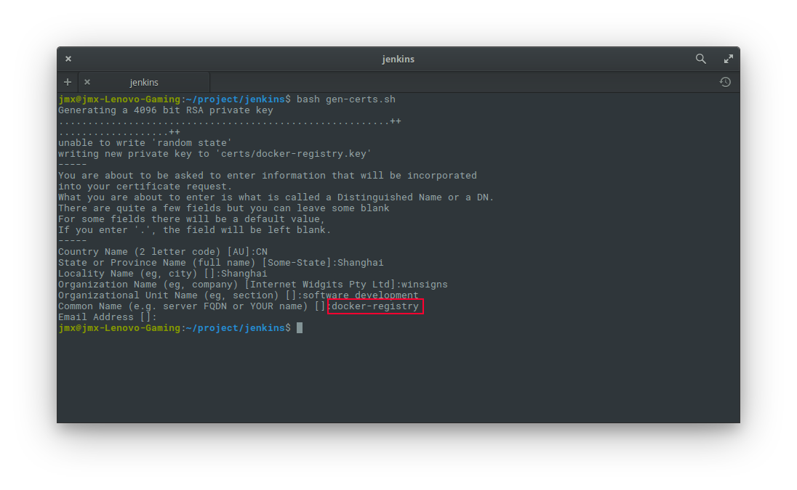

# 持续集成系统部署文档

按照[版本管理及持续集成设计](./continuous-integration.md)的方案，进行持续集成系统的部署及开发。部署使用docker-compose完成。

## 系统要求

整个持续集成系统由以下服务器组成。绝大部分服务均由对应的docker container提供，由docker-compose进行编排。因此所有服务器都需要事先安装docker与docker-compose。并将dns解析地址配置成DNS服务器地址（DNS服务器自身除外）。服务器最好都能访问互联网，方便一些联网操作（但无需在互联网上开放服务）。

* maven registry 服务器。用于提供maven仓库。
* docker registry 服务器。用于提供docker仓库及docker仓库的web ui。
* jenkins服务器。用于提供持续集成服务。
* dns服务器。为各个内部服务器提供伪域名服务。
* 前置服务器。为上述服务器的web界面提供统一的入口，避免使用端口直接访问。
* 测试服务器。为持续集成提供自动化测试及手工测试环境。服务器数量待进一步讨论。

为节省资源，简化部署，在服务器能力足够的情况下，可以酌情将除测试服务器外的其他服务器进行合并。测试服务器需要的资源较多，建议独立。

## docker 及 docker-compose 安装

* [docker安装指南](https://docs.docker.com/engine/installation/)（官方英文文档）
* [docker-compose安装指南](https://docs.docker.com/compose/install/)（官方英文文档）

## DNS服务安装

在DNS服务器上安装`dnsmasq`服务。然后将我们自定义的域名配置在`/etc/hosts`文件中。

## 反向代理服务安装

在前置服务器上安装`nginx`服务作为内部各web服务的反向代理服务。nginx的配置请参考官方文档，这里不再赘述。

## maven registry 安装

1. 在maven registry服务器上运行 `docker-compose -f maven-regitry.yml up -d`启动maven registry服务。
2. 上述命令会在host上打开一个`8889`端口的http服务。在前置服务器上配置，将域名`repo.winsigns-dev.com`反向代理至该服务。
3. 在dns服务器上配置`repo.winsigns-dev.com`为前置服务器地址。
4. 浏览器访问`http://repo.winsigns-dev.com/artifactory`,进行初始化配置。需要配置4个远程maven仓库(注意大小写)：
   * jcenter: https://jcenter.bintray.com
   * mavenCentral: https://repo1.maven.org/maven2
   * spring-milestone: https://repo.spring.io/milestone
   * spring-snapshot: https://repo.spring.io/snapshot
5. 在开发人员的桌面环境中，将dns解析地址配置成dns服务器所在地址。

_**NOTE:** DNS、初始化配置只需第一次执行。后续除非重装，否则不需要再次运行。_

经过上述步骤，开发人员应该可以正常使用项目中的build.gradle文件进行编译了。

## docker registry 安装

1. 在docker registry服务器上执行`bash gen-certs.sh`生成证书。注意红框部分必须填写正确：

   

2. 将`certs/docker-registry.crt`复制到`/etc/docker/certs.d/docker-registry:5000/ca.crt`。

3. 重启本地docker服务：`sudo service docker restart`

4. 使用 `docker-compose -f docker-registry.yml up -d` 启动docker registry及web ui服务。

5. docker registry的端口是`5000`，web ui的端口是`8899`。在前置服务器上配置，将域名`docker-hub.winsigns-dev.com`反向代理至docker registry web ui服务。

6. 在dns服务器上将 `docker-registry` 配置成docker registry服务器的地址。将`docker-hub.winsigns-dev.com`配置成前置服务器的地址。

_**NOTE:** 生成证书、证书复制和dns配置只需第一次执行。后续除非重装，否则不需要再次运行。但一旦重新生成证书，必须要重新复制。包括下文提到的jenkins的证书复制，复制完成后需要执行步骤3，重启docker服务。_

经过上述步骤，可以通过 `docker push` 推送 docker image至docker registry。

## jenkins安装

1. 将上一步docker registry安装时生成的证书，复制到jenkins所在服务器的`/etc/docker/certs.d/docker-registry:5000/ca.crt`
2. 重启本地docker服务：`sudo service docker restart`
3. 使用 `docker-compose -f jenkins.yml up --build -d`启动jenkins服务。这里会使用 `jenkins-with-docker`目录中定义的Dockerfile重新创建一个docker image。该image在原官方jenkins image的基础上增加了docker的安装。
4. Jenkins服务的端口是`8888`。在前置服务器上配置，将域名 `jenkins.winsigns-dev.com`反向代理至Jenkins服务。
5. 在dns服务器上将`jenkins.winsigns-dev.com`配置成jenkins服务器的地址。
6. 通过浏览器访问 `jenkins.winsigns-dev.com`，对jenkins进行配置与管理。（首次启动时需要Adminstrator初始密码，这个密码可以通过 `docker logs [jenkins运行容器ID]`查看到。jenkins运行容器ID可以用 `docker ps`命令查看。）
